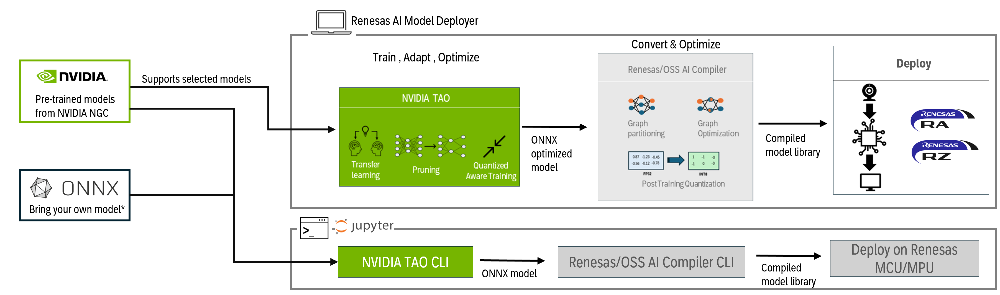

# Renesas-NVIDIA TAO Integration

## 🚀 Introduction

### 🎉Renesas AI Model Deployer v1.1.0 released 

This repository provides demos, scripts, and an intuitive GUI to enable the [**NVIDIA TAO (Train, Adapt, Optimize) Toolkit**](https://developer.nvidia.com/tao-toolkit) on **Renesas hardware**, including DRP-AI-based MPUs and high-performance MCUs.

- For **beginners**, the **Renesas AI Model Deployer** abstracts the command-line interface, enabling local execution on workstations for rapid evaluation and prototyping from training to deployment.  
- For **intermediate/advanced users**, a set of **Jupyter Notebooks** are included, offering deeper levels of customization, integration, and optimization.

NVIDIA TAO Toolkit is a low-code AI framework built on top of Pytorch/Tensorflow that enables users to train, fine-tune, and optimize state-of-the-art deep learning models for vision, speech, and language tasks.

The overall flow of Renesas' integration with the NVIDIA TAO Toolkit is illustrated below:  


---

## 📁 Repository Structure

- **`board_bringup/`** – Instructions to bring up Renesas boards and prepare the environment for deployment.
- **`docs/`** – Reference documents, assets, and collateral.
- **`examples/`** – End-to-end demo pipelines provided by Renesas. As of the current release, the following three pipelines are supported:


| Model                                   | Pipeline Support      | Use Case             | Devices Supported       | Reference                                                                                              |
|----------------------------------------|------------------------|-----------------------|--------------------------|----------------------------------------------------------------------------------------------------------|
| MobileNet v2                            | GUI & Notebooks       | Image Classification | RA8D1                    | [NGC Pretrained Classification](https://catalog.ngc.nvidia.com/orgs/nvidia/teams/tao/models/pretrained_classification) |
| SegFormer-FAN hybrid Vision Transformer | GUI & Notebooks       | Image Classification | RZ/V2H or RZ/V2L         | [NGC Pretrained SegFormer](https://catalog.ngc.nvidia.com/orgs/nvidia/teams/tao/models/pretrained_segformer_nvimagenet) |
| DetectNetv2 (ResNet18 backbone)         | GUI & Notebooks       | Object Detection      | RZ/V2H or RZ/V2L         | [TAO Pretrained DetectNet V2](https://catalog.ngc.nvidia.com/orgs/nvidia/teams/tao/models/pretrained_detectnet_v2)     |


- **`gui/`** – Instructions and usage guide for Renesas AI Model Deployer, along with explanations of available functionalities.
- **`quick_deploy/`** – Ready-made application examples (developed via by the GUI) for quick on-board performance validation.
- **`setup/`** – Setup guide to install NVIDIA TAO , GPU drivers, Renesas SDKs, and other required software.
- **`releases`** - Contains the ecncapsulated package with Renesas AI Model Deployer, Jupyter notebooks and one-click installation scripts allowing customers for quick install & play.


## 🖥️ System Requirements

### Supported Operating Systems
The Toolkit is tested and verified on **Ubuntu 20.04 LTS** and **Ubuntu 22.04 LTS**.


### Hardware Requirements

#### Minimum Configuration
- 8 GB system RAM  
- 4 GB GPU RAM  
- 8-core CPU  
- 1 NVIDIA GPU  
- 100 GB SSD storage  

#### Recommended Configuration
- 32 GB system RAM  
- 32 GB GPU RAM  
- 8-core CPU  
- 1 NVIDIA GPU  
- 100 GB SSD storage  

> **Note:**  
> TAO Toolkit is supported on discrete GPUs such as **H100, A100, A40, A30, A2, A16, A100x, A30x, V100, T4, Titan RTX, and Quadro RTX**.  
> It is **not supported on GPUs older than the Pascal generation**.

### Software Requirements
-	Python (=3.8)
-	docker-ce (>19.03.5)
-	docker-API (1.40)
-	Nvidia-container-toolkit (>1.3.0-1)
-	nvidia-container-runtime (3.4.0-1)
-	nvidia-driver (>535.xx)
-	python-pip (>21.06)

> **Note:**  
> All necessary system installations are handled by the provided scripts 

## Getting started

To get started using **Renesas AI Model Deployer** and the **Jupyter notebooks**:

1. Please download `Renesas_AI_Model_Deployer_v_x.y.z.tar` under assets in [releases](https://github.com/renesas/Renesas-Nvidia-TAO-Integration/releases/latest).

2.  Get your NVIDIA NGC API Key to access the NVIDIA TAO Toolkit:
    - Go to the [NGC sign-in page](https://ngc.nvidia.com/signin) and log in.
    - Click your username in the top-left corner.
    - Select **Setup** → **Generate API Key**.
    - Choose both services (NGC Catalog & Helm Chart Registry).
    - Click **Generate Key**, then copy and store it in a safe location to be inputted during next step.

3. Run the following shell scripts within the untarred directory, its recommended to run them one by one:

    ```sh
    chmod ug+x *.sh
    chmod ug+x bin/*.sh
    ./docker_gpu_install.sh
    ./setup_tao_env.sh
    ```
    This should start the setup script and install the necessary dependancies to use the GUI and the Jupyter notebooks. Ensure to select `TAO`, `TOOLs`, `Easy_GUI` and `Pre_image`.   
    For Reneasas RZ/V, please install and setup AI SDK that includes DRP-AI TVM v2.5, steps 3-5 from [here](https://renesas-rz.github.io/rzv_ai_sdk/latest/getting_started.html#step3).
    ```sh
    groups
    ```
    If '''docker''' is not in the reported groups then a reboot is required to finish the installation.
   
5. To start Renesas AI Model Deployer:
    ```sh
    ./gui_start.sh 
    ```
6.  For the Jupyter Notebooks, execute in untarred project directory:
    ```sh
    ./jupyter-notebook
    ```

For further explanation and error handling, please review the **`setup/`** directory.  


## Supported Hardware and Kits

Renesas AI Model Deployer currently supports the following hardware based on respective pipeline:

| Device  | Evaluation Kit                                                                 | Use Case                                                                 |
|---------|----------------------------------------------------------------------------------|--------------------------------------------------------------------------|
| RZ/V2L  | [RZ/V2L-EVKIT](https://www.renesas.com/en/products/microcontrollers-microprocessors/rz-mpus/rzv2l-evkit-smarc-som-evaluation-kit-rzv2l-mpu-ai-accelerator) | SegFormer-FAN hybrid Vision Transformer, DetectNetv2                     |
| RZ/V2H  | [RZ/V2H-EVKIT](https://www.renesas.com/en/products/microcontrollers-microprocessors/rz-mpus/rzv2h-evk-rzv2h-quad-core-vision-ai-mpu-evaluation-kit)             | SegFormer-FAN hybrid Vision Transformer, DetectNetv2                     |
| RA8D1   | [EK-RA8D1](https://www.renesas.com/en/products/microcontrollers-microprocessors/ra-cortex-m-mcus/ek-ra8d1-evaluation-kit-ra8d1-mcu-group)                     | MobileNetV2                                                              |
---
  
## Release Notes
Renesas AI Model Deployer v1.1.0 has been released with following updates:  
1. Detectnetv2 bounding box issue has been resolved.
2. Detectnetv2 pipeline allows variable input image resolution.
3. FAN-Segformer classification issue has been resolved.
4. DRP-AI has been updated leading to a speedup of up to 10x depending on the used AI-model.
5. GUI improvements and enhancements.
6. Quick deploy binaries have been included in binary to test application examples without installing all the S/W.


