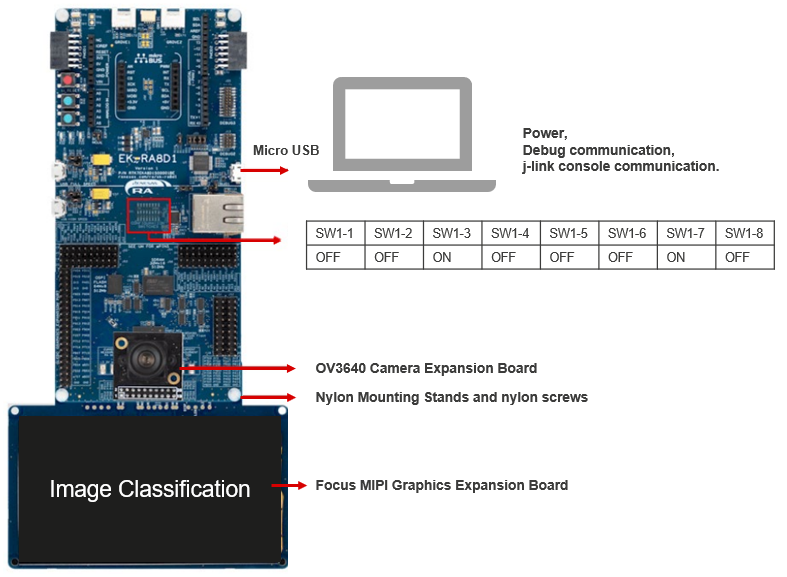

# EK-RA8D1 Quick Setup Overview

Setting up the RA8D1 platform involves two main tasks:

1. **Installing the e2 studio on host machine** — used for compiling mcu project with learned model.FSP 5.7.0 was used for testing.  
2. **Preparing the EK-RA8D1**

---

## 🧰 Required Equipment
| **Component**                   | **Details**                                                                                           |
|---------------------------------|-------------------------------------------------------------------------------------------------------|
| **EK-RA8D1**                    | Main board for AI demo execution                                                                      |
| **Micro USB Cable**             | Connects power adapter to the board and deploys the application                                       |
| **Host PC**                     | For e2 studio installation  *OS:* Ubuntu 20.04, 22.04,   Windows 10, 11,   |
| **Camera Expansion Board**      | For connecting parallel camera to EK-RA8D1 board (included in evaluation kit)                              |
| **MIPI Graphics Expansion Board** | For connecting display to EK-RA8D1 board (included in evaluation kit)                               |

---

## 🔌 Hardware Connectivity

To run the demo end-to-end with GUI visualization, ensure the following connections:

- `EK-RA8D1 → Micro USB Cable → Host PC`
- `EK-RA8D1 → Camera Expansion Board`
- `EK-RA8D1 → MIPI Graphics Expansion Board`

### Hardware Setup Diagram

---
