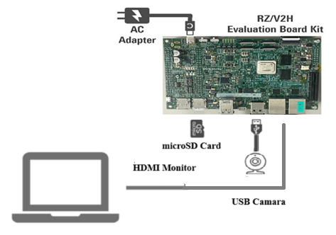

# RZ/V2H EVKit Quick Setup Overview

Setting up the RZ/V2H platform involves two main tasks:

1. **Installing the RZ/V2H AI SDK on an Ubuntu host machine** — used for model conversion and deployment via the GUI.
2. **Preparing the RZ/V2H EVKit** — including hardware connections and SD card setup.

---

## 🔧 Setup Overview

For detailed instructions, refer to the [RZ/V AI GitHub repository](https://renesas-rz.github.io/rzv_ai_sdk/latest/getting_started.html). Be sure to select the latest version from the top-left dropdown. Here's a quick summary:  
>**Important note:** AI SDK V5.20 for RZ/V2H lags behind the latest DRP-AI TVM v2.5 library and DRP-AI Translator version, in order to get ~30 ms inference performance for Detectnetv2 pipeline, ensure updating the DockerFile and DRP-AI Translator binary.

### ✅ Step-by-Step Summary

- **Steps 1–2**: Acquire the board and required components (see table below).
- **Steps 3–4**: Download the RZ/V2H AI SDK and set up the Docker container. For optimal performance, use **DRP-AI TVM v2.5**. 
- **Steps 4.5**:Before set up and after downloading and unzipping the AI SDK folder, for V2H, the AI SDK v5.20 should be patched for best performance as follows:
    - In ``ai_sdk_setup`` directory, please replace ``DRP-AI_Translator_i8-v1.02-Linux-x86_64-Install`` with ``DRP-AI_Translator_i8-v1.10-Linux-x86_64-Install``that can be installed from [here](https://www.renesas.com/en/software-tool/drp-ai-translator-i8#overview). 
    - Please replace the DockerFile in ``ai_sdk_setup`` with the one that can be downloaded via the following command:
    ``` 
    wget https://raw.githubusercontent.com/renesas-rz/rzv_drp-ai_tvm/main/DockerfileV2H -O DockerfileV2H
- **Step 5**: Continue with the steps described in [RZ/V AI GitHub repository](https://renesas-rz.github.io/rzv_ai_sdk/latest/getting_started.html).
- **Step 7**: Format the microSD card and flash the bootloader and Yocto image. This is essential for new boards or SDK updates. Ensure you have partitioned your microsD card appropriately.
- **Final Setup**: Connect the board as shown in *Figure below*. Note: DSW1 & DSW2 switch orientation depends on your bootloader choice (eSD/eMMC).
- **Shutdown**: Follow the [safe shutdown procedures](https://renesas-rz.github.io/rzv_ai_sdk/latest/appendix.html#A3).


> **Note:** On your board, check if libtvm_runtime.so exists under /usr/lib64 directory of the root filesystem of the board. If not copy from docker ‘/drp-ai_tvm/obj/build_runtime/V2H/’ folder path to board under /usr/lib64 via secure copy.         

---

## 🧰 Required Equipment

| **Component**           | **Details**                                                                 |
|------------------------|------------------------------------------------------------------------------|
| **RZ/V2H EVKit**        | Main board for AI demo execution                                            |
| **USB Type-C Cable**    | Connects power adapter to the board                                         |
| **AC Adapter**          | Powers the board                                                            |
| **USB Camera**          | For visualizing inference results                                           |
| **microSD Card**        | Minimum 4GB free space<br>*Recommended:* Transcend USH-I microSD 300S 16GB  |
| **Linux PC (Host)**     | For SDK installation and SD card setup<br>*OS:* Ubuntu 20.04                |
| **SD Card Reader**      | Used to flash bootloader and OS image                                       |
| **USB Hub**             | For connecting keyboard and mouse                                           |
| **USB Keyboard & Mouse**| For terminal and GUI interaction                                            |
| **HDMI Monitor**        | *Optional:* Needed for standalone GUI apps                                  |
| **Micro HDMI Cable**    | Connects board to HDMI monitor                                              |
| **Ethernet Cable**      | Enables board-host communication                                            |

---

## 🔌 Hardware Connectivity

To run the demo end-to-end with GUI visualization, ensure the following connections:

- `RZ/V2H → Ethernet → Host PC`
- `RZ/V2H → USB Camera`
- `RZ/V2H → USB-C → Power Adapter`

### Hardware Setup Diagram



---

## 📌 Notes

- This page serves as a **quick-start checklist** to ensure you have the right equipment and understanding before setup.
- For scripts, troubleshooting, and advanced usage, always refer to the [RZ/V AI GitHub repository](https://renesas-rz.github.io/rzv_ai_sdk/latest/) and [DRP-AI TVM GitHub page](https://github.com/renesas-rz/rzv_drp-ai_tvm/tree/main).

---

