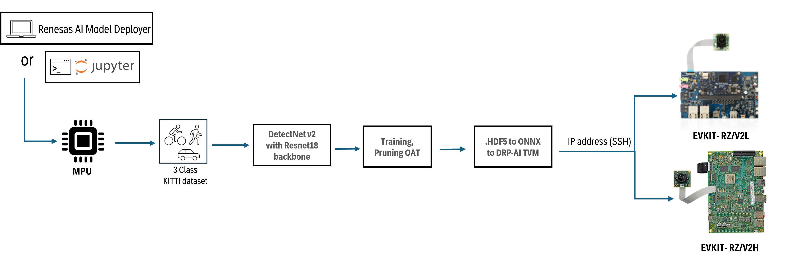
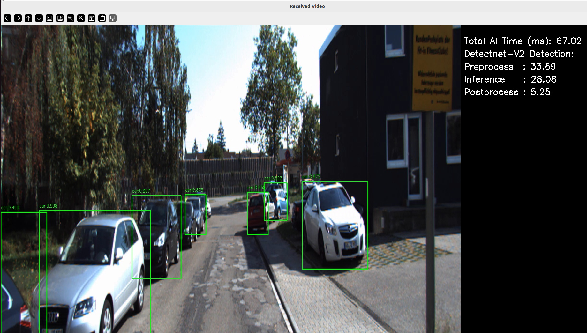

## Introduction

DetectNet_v2 is a deep learning object detection model provided by NVIDIA through the TAO Toolkit. It uses a grid-based, anchor-free approach for detecting objects, making it ideal for real-time applications on embedded systems. Renesas AI Model Deployer leverages Detectnetv2 with ResNet-18 backbone and exports to ONNX without TensorRT plugin layers, ensuring compatibility with DRP-AI accelerator. The GUI provides access to pruning and quantized aware training (QAT) features from NVIDIA TAO along with `.yaml` file definition for Detectnetv2 hyperparameters.  

> **Note** : DetectNet v2 uses unstructured pruning in TAO to zero out low-magnitude weights. While the model architecture remains unchanged, retraining with sparsity encourages generalization and can improve accuracy.  

High level flow of DetectNet v2 pipeline:



> **Note** : To optimize the pipeline further, developers are encouraged to tune the various hyperparameters in `.yaml` file to achieve better performance.

## Before you start

### Hardware setup 

Ensure you have completed the board setup steps  for [RZ/V2L](../../board_bringup/rz_v2l/readme.md) and [RZ/V2H](../../board_bringup/rz_v2h/readme.md) in their respective READMEs.


### Software setup

#### Model download 
To train the model, download the pretrained weights from Nvidia NGC [here](https://catalog.ngc.nvidia.com/orgs/nvidia/teams/tao/models/pretrained_classification/files?version=resnet18).   
Please store the `.hdf5` model under `<projectdirectory>/utils/configs/detection/pretrained_model/`. 

#### Dataset download

For this demo, a KITTI-formatted dataset is used to train the model with three classes: pedestrian, cyclist, and car. While the original KITTI dataset includes additional labels, the `.yaml` configuration file merges certain categories to simplify the task and focus on three primary object types. Bounding boxes are drawn for each of the three classes during inference.


- The dataset can be downloaded from [here](https://www.cvlibs.net/download.php?file=data_object_image_2.zip).
- The labels are available [here](https://www.cvlibs.net/download.php?file=data_object_label_2.zip).

For more details on the dataset, please visit the KITTI vision benchmark suite webpage [here](https://www.cvlibs.net/datasets/kitti/eval_object.php?obj_benchmark=2d).

The folder structure for the dataset follows KITTI convention:
```
KITTI/
├── images/         # contains image files (.png or .jpg)
│   ├── 000000.png
│   ├── 000001.png
│   └── ...
├── labels/         # contains label files (.txt) with class names and bounding boxes
│   ├── 000000.txt
│   ├── 000001.txt
│   └── ...
```

## GUI 


To launch the GUI, navigate to project directory:
```bash
./gui_start.sh
```

A simple end-to-end GIF can be viewed below:


For more detailed instructions, please visit [GUI directory](../../gui/readme.md).  

## Results 

The results of training can be seen in table below:


**DetectNet V2 – Model Performance**

- **Confidence Threshold:** 0.5  
- **Resolution:** 384×1248  
- **Epochs:** 120  

| **Results**                 | **Car (AP)** | **Pedestrian (AP)** | **Cyclist (AP)** | **mAP**   |
|----------------------------|-------------|--------------------|-----------------|---------|
| **HDF5 (test data)**       | 71.61%      | 62.93%             | 85.66%          | 73.40%  |
| **ONNX (test data)**       | 71.60%      | 62.88%             | 85.59%          | 73.36%  |
| **Board V2H(without calibration)**       |  53.68%      | 48.26%            | 56.33%          | 52.76%  |


### Detectnet V2 – Inference Benchmark

| Board   | Inference Time (ms) |
|------------|-------------------------|
| **RZ/V2L** | ~210      |
| **RZ/V2H** | ~28         |
------------------

A snippet of inference on board via a pre-recorded slideshow is shown below:



## Deploy without GUI

The GUI allows you to run inference via a connected USB camera to the MPU board. For demo purposes, the model was trained on static images which would lead to reduced accuracy via the USB camera, as such, it is possible to run inference on a video with a collection of training images. 
To achieve that, after export and deployment via GUI, a new folder will be created under `<project_directory>/assets/<Project_name>/<Project_name>`.
This folder will be the app that contains the embedded code and model object code that has been deployed on to the board. 
You will need to secure copy a set of images bundled into a video to the same directory onto the MPU `/home/root/<Project_name>`, from there you can then run the app with `VIDEO <name_of_video>` command. 
In general, this is the same method use as in [quick deploy](/quick_deploy/README.md). Following that method would allow you to vizualize your trained model performance on a test dataset of your choice in a video format. 
A video test dataset is provided in the `.tar.gz` files in quick deploy as well.


## Jupyter Notebook

Before using the Jupyter Notebooks, make sure the setup scripts have been executed.

1. Copy the `detectnet_v2` folder from `jupyter_notebooks` folder to the `assets` directory.
    ```
    cp -r jupyter_notebooks/detectnet_v2/ assets/
    ```
2. Open terminal in application root directory and run below command to start the Jupyter notebook server:
    ```
    ./jupyter-notebook
    ```
3. After server is up, navigate into the `assets/detectnet_v2` directory and start the jupyter notebook `detectnet_v2_V2L_V2H.ipynb`
    take care that the selected jupyter kernel is SOS.
4. Select Jupyter notebook kernel as `SoS` and all the cells to be executed with `SoS` kernel.
5. Please take care of dataset  as you would need to move it to the dataset directory..


