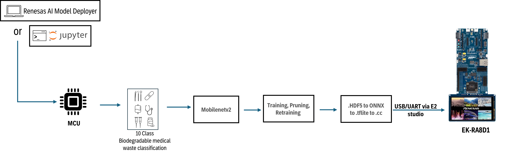
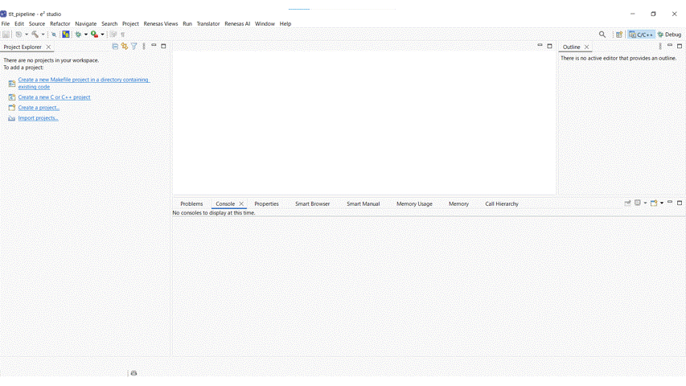

## Introduction

MobileNet_v2 is a deep learning image classification model provided by NVIDIA through TAO. It uses a highly lightweight structure for efficient image processing, making it ideal for real-time applications on embedded systems. Renesas AI Model Deployer leverages MobileNet_v2 backbone and exports to tflite format for tflite-micro, ensuring compatibility with Helium MVE-accelaration of Cortex-M85, RA8D1. The GUI provides access to pruning features from NVIDIA TAO toolkit along with `.yaml` file definition for MobileNet_v2 hyperparameters.

#### High level flow of MobileNet_v2 pipeline



> **Note** : To optimize the pipeline further, developers are encouraged to tune the various hyperparameters in `.yaml` file to achieve better performance.

## Before you start

### Hardware setup 

Ensure you have completed the board setup steps  for [RA8D1](../../board_bringup/ra8d1/readme.md) in its respective READMEs.

### Software setup

#### Model download 
To train the model, download the pretrained weights from Nvidia NGC [here](https://catalog.ngc.nvidia.com/orgs/nvidia/teams/tao/models/pretrained_classification/files?version=mobilenet_v2).   
Please store the `.hdf5` model under `<projectdirectory>/utils/config/Classification/mobilenet_v2/pretrained_models/`. 

#### Dataset download

For this demo, an ImageFolder-formatted dataset is used to train a model on ten classes: biodegradable, cardboard, glass, gloves, masks, meficines, metal, paper, plastic, and syringe.

The dataset can be downloaded from [RoboFlow.](https://universe.roboflow.com/gkhang/classification-waste)

The folder structure for the dataset should be as follows:
```
Dataset/
├── Cardboard/     # contains .jpg images of cardboard
│   ├── cardboard1.jpg
│   ├── cardboard2.jpg
│   └── ...
├── Glass/         # contains .jpg images of glass
│   ├── glass1.jpg
│   ├── glass2.jpg
│   └── ...
├── Gloves/        # contains .jpg images of gloves
│   ├── gloves1.jpg
│   ├── gloves2.jpg
│   └── ...
├── ...            # and so on for the remaining 7 classes

```
During inference, input images are classified into one of these ten classes.

## GUI 

To launch the GUI, navigate to project directory:
```bash
./gui_start.sh
```

A simple end-to-end GIF can be viewed below:


For more detailed instructions, please visit [GUI directory](../../gui/readme.md).  

## How to compile from e2 studio
A simple end-to-end GIF can be viewed below:


For more detailed instructions, please confirm below steps:

- **Step 1** : Open e2 studio and import the project, the project can be found under `<project_root/utils/configs/Classification/mobilenet_v2/RA8D1_app>`.
- **Step 2** : Replace the `model.cc` file in `src/ai_apps/image_classification` with the model generated by GUI or Jupyter notebook and delete `src/ai_apps/image_classification/mobilenet_v1_0.25_224_INT8_tflite.cc`.
- **Step 3** : Edit `model.cc` as follows:
#### First line
```diff
- unsigned char _home_usr_TAO_TLT_assets_mobilenet_v2_export_model_tflite[] = {
+ #include "BufAttributes.hpp"
+ #include <cstddef>
+ #include <cstdint>

+ namespace arm {
+ namespace app {
+ namespace img_class {


+ static const uint8_t nn_model[] MODEL_TFLITE_ATTRIBUTE =
+ {
```
#### Last line
```diff
- unsigned int _home_usr_TAO_TLT_assets_mobilenet_v2_export_model_tflite_len = 854848;
+ const uint8_t * GetModelPointer()
+ {
+     return nn_model;
+ }

+ size_t GetModelLen()
+ {
+     return sizeof(nn_model);
+ }

+ } /* namespace arm */
+ } /* namespace app */
+ } /* namespace img_class */
```
- **Step 4** : Compile the project by clicking on the build button and confirm that the `.hex` file is generated in the `Debug` folder.
- **Step 5** : Deploy from e2 studio by clicking on the Debug button. You can view the inference result in the MIPI display as standalone.


## Results

The results of training can be seen in table below:

| Model              | Model size(FP32) | Accuracy | Remarks |
|--------------------|------------------|----------|---------|
| Trained model      | 27.7MB           | 80.6%    | Includes Adam optimizer state variables. |
| Pruned model       | 4.0MB            | -        |                                          |
| Retrained model    | 11.2MB           | 76.3%    | Includes Adam optimizer state variables. |
| Tflite model       | 1.1MB            | 76.3%    |                                          |

The AI inference on RA8D1 boards is as follows:

| Board   | Inference speed (ms) |
|---------|-----------------------|
| RA8D1   | ~ 300-500                 |

> **Note** : Model size and inference speed depend on pruning results. For the same model structure, pruning reductions vary based on learned weights.

## Jupyter Notebook
Before using the Jupyter Notebooks, make sure the setup scripts have been executed.

1. Copy the `mobilenet_v2` folder from `jupyter_notebooks` folder to the `assets` directory.
    ```
    cp -r jupyter_notebooks/mobilenet_v2/ assets/
    ```
2. Open terminal in application root directory and run below command to start the Jupyter notebook server:
    ```
    ./jupyter-notebook
    ```
3. After server is up, navigate into the `assets/mobilenet_v2` directory and start the jupyter notebook `mobilenet_v2_RA8D1.ipynb`
    take care that the selected jupyter kernel is SOS.
4. Select Jupyter notebook kernel as `SoS` and all the cells to be executed with `SoS` kernel.
5. Please take care of dataset as you would need to move it to the dataset directory and split it to `train:valid:test` manually.