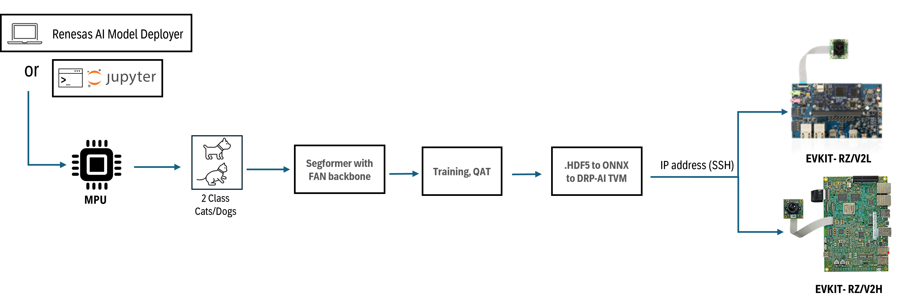

## Introduction

FAN Classification is a vision transformer-based image classification model provided by NVIDIA through TAO. It leverages the SegFormer architecture with a FAN (Fully Attentional Network) backbone, combining efficient hierarchical encoding with robust attentional processing. The Renesas AI Model Deployer integrates this model as part of an end-to-end proof of concept (PoC) pipeline to demonstrate image classification workflows. The model is exported to ONNX format for compatibility with the DRP-AI accelerator, and the GUI supports standard TAO features using YAML-based configuration files.

High level flow of Segformer pipeline:




## Before you start

### Hardware setup 

Ensure you have completed the board setup steps  for [RZ/V2L](../../board_bringup/rz_v2l/readme.md) and [RZ/V2H](../../board_bringup/rz_v2h/readme.md) in their respective READMEs.


### Software setup

#### Model download 
To train the model, the model should be downloaded from NVIDIA NGC [here](https://catalog.ngc.nvidia.com/orgs/nvidia/teams/tao/models/pretrained_segformer_nvimagenet).   

Please store the `.hdf5` model under `<projectdirectory>/utils/config/Classification/segformer/pretrained_models/`. 

### Dataset download

For this demo, a simple cat/dog classification dataset will be used to demonstrate the operation of the pipeline. 
The dataset can be downloaded from [Kaggle](https://www.kaggle.com/datasets/tongpython/cat-and-dog/data).

The folder structure for the dataset should be as follows:
```
Dataset/
├── Cats/     # contains .jpg images of cats
│   ├── cat1.jpg
│   ├── cat2.jpg
│   └── ...
├── Dogs/     # contains .jpg images of dogs
│   ├── dog1.jpg
│   ├── dog2.jpg
│   └── ...
```


## GUI  

To launch the GUI, navigate to project directory:
```bash
./gui_start.sh
```

A simple end-to-end GIF can be viewed below:


For more detailed instructions, please visit [GUI directory](../../gui/readme.md).  


## Results 

The results of training after 300 epochs can be seen in table below:

|          | precision | recall | f1-score |
|----------|-----------|--------|----------|
| cats     | 0.93      | 0.86   | 0.9      |
| dogs     | 0.87      | 0.94   | 0.91     |
| accuracy | 0.9       | 0.9    | 0.9      |


AI inference on RZ/V boards for this model runs entirely on the CPU, as it is not currently supported by the DRP-AI accelerator. As a result, inference performance is lower compared to models optimized for DRP-AI.

> **Note:** Currently an embedded bug has been found in the postprocessing that causes dogs to be consistenly infered as, the following issue will be fixed in the next release of the tool.


## Jupyter Notebook
Before using the Jupyter Notebooks, make sure the setup scripts have been executed.

1. Copy the `segformer` folder from `jupyter_notebooks` folder to the `assets` directory.
    ```
    cp -r jupyter_notebooks/segformer/ assets/
    ```
2. Open terminal in application root directory and run below command to start the Jupyter notebook server:
    ```
    ./jupyter-notebook
    ```
3. After server is up, navigate into the `assets/segformer` directory and start the jupyter notebook `Segformer_RZ_V2H_V2L.ipynb`
    take care that the selected jupyter kernel is SOS.
4. Select Jupyter notebook kernel as `SoS` and all the cells to be executed with `SoS` kernel.
5. Please take care of dataset as you would need to move it to the dataset directory and split it to `train:valid:test` manually.


## Known Issues

- In the Segformer demo, at deployment on MPU, the output is always "dog" due to a post-processing bug during deployment. This issue will be addressed in the upcoming release.


