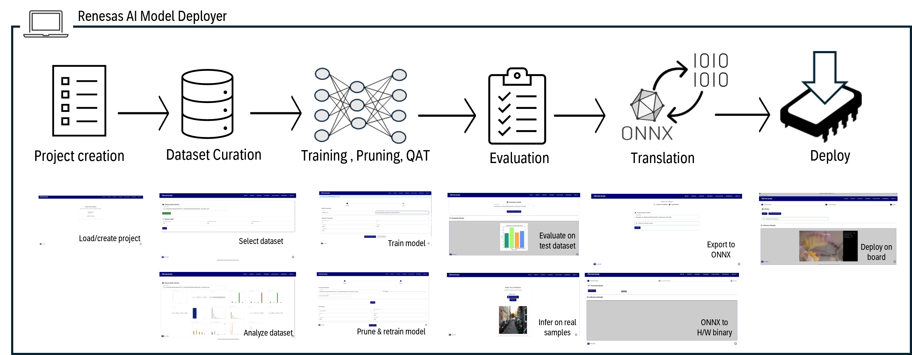
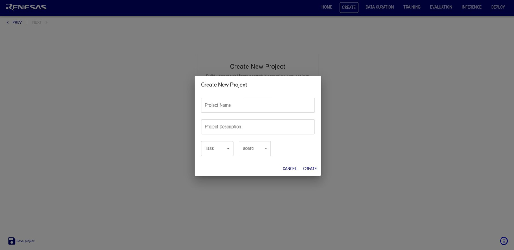
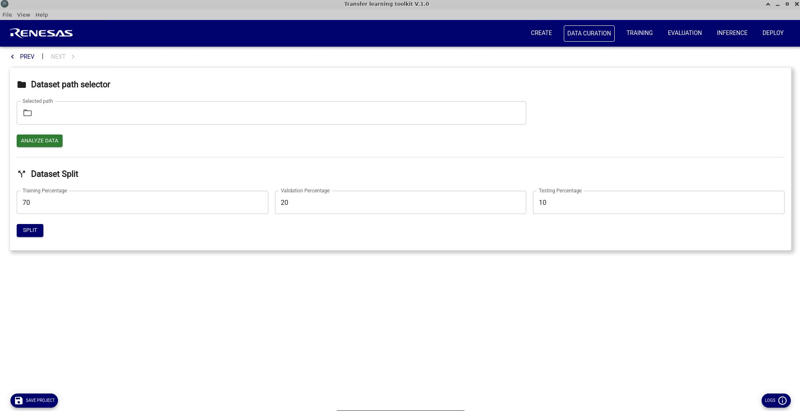
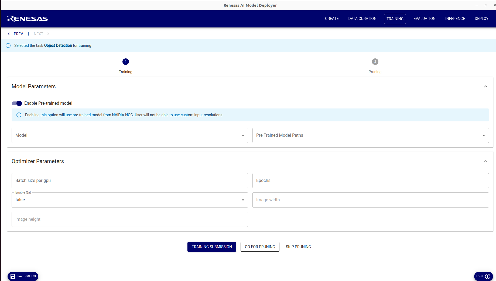
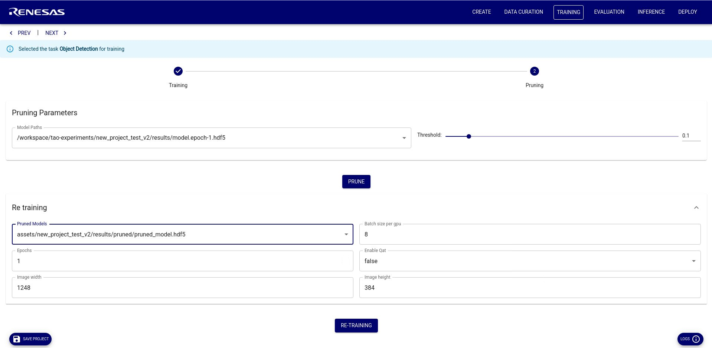
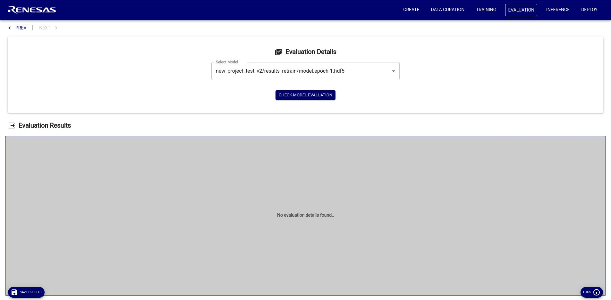
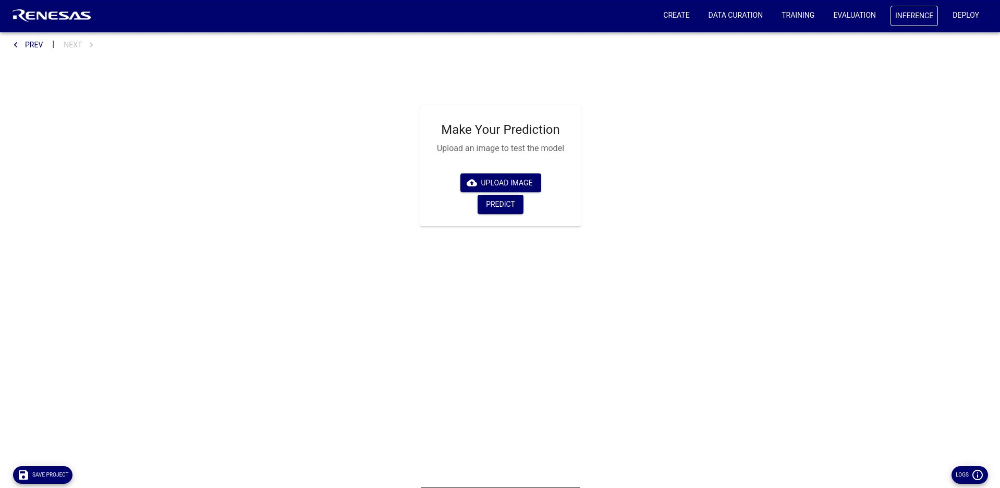

# Renesas AI Model Deployer

**Renesas AI Model Deployer** is a lightweight, no-code GUI designed to streamline vision AI workflows on Renesas edge platforms using NVIDIA TAO . It offers developers an accessible, end-to-end pipeline to build, evaluate, and deploy AI models—leveraging NVIDIA-provided pretrained models and built-in optimization techniques such as pruning and quantization.


## 🔧 What It Does

- **Easy Setup**: Launch the GUI and environment using two shell scripts.
- **Project-Based Workflow**: Define the model architecture, board type, and task (classification or detection).
- **Dataset Tools**: Split datasets, check class balance, and prepare them for training.
- **Model Training & Optimization**: Supports pruning and Quantization-Aware Training (QAT).
- **Evaluation**: Visual performance metrics (mAP, Top-K accuracy).
- **Inference**:
  - Test with static images or samples.
  - Live USB/camera streaming support.
- **Deployment**: Export and flash models directly to supported Renesas hardware.

## 🖼 GUI Preview

To start the GUI, in project directory:
```sh
./gui_start.sh
```
The overall GUI flow mapped to NVIDIA toolkit features shown in figure below:




## End-to-End Flow

### 1. Project Creation

When you open the GUI, you are greeted with a landing page where you can either create a new project or load an existing one.

To create a project, you can specify the project name, provide a description, choose the vision problem (image classification or object detection), and select the target board.



> **Note:** Currently, only MPUs are supported for the object detection pipeline.

---

### 2. Data Curation

On the data curation page, you can upload your dataset in the required format (as explained in the examples).  
You can then visualize the dataset to inspect the number of classes, sample counts, and class distribution.  
The dataset can be split into training, validation, and testing sets.


---

### 3. Training

On the training page, you select the model and its corresponding backbone. You can also choose to load a pre-trained model if you'd like to fine-tune it further.

Some configurable parameters within the GUI include:

- **Batch size**: Number of images processed per training step  
- **Epochs**: Number of complete training cycles over the dataset  
- **Enable QAT**: Option to use Quantization-Aware Training (for retraining)  
- **Image Width/Height**: Input size for the model (dependent on your dataset/model)
- **Enable  Pre-trained model**: For the DetectNetV2 model, disabling this option uses a randomly initialized model instead of a pre-trained one. This lets you train on images with custom dimensions (multiples of 16) rather than being restricted to the KITTI resolution used by the pre-trained model.

> **Note:** If the accuracy is not satisfactory after evaluation, you can retrain the model by re-running this step.  
For advanced configuration, modify the `train_config.yaml` file directly.



---

### 4. Pruning & Retraining

TAO provides two types of pruning:

- **Unstructured Pruning**: Removes individual weights based on their magnitude. This does not alter the model architecture and often improves accuracy. (Used in the DetectNet_v2 demo)

- **Structured Pruning**: Removes entire filters or neurons, reducing model size and changing architecture. This can lead to reduced accuracy, which can be recovered through retraining. (Used in the MobileNetv2 demo)

After pruning, retraining is strongly recommended to recover or improve model accuracy. The retraining step uses the same parameters as the training phase.



---

### 5. Evaluation

On the evaluation page, the test dataset is used to assess model performance.  
Depending on the selected demo, different evaluation metrics (e.g., mAP, accuracy, precision, recall) will be displayed.


---

### 6. Inference

The inference page allows you to run inference on specific test images using your trained model.  
This visual feedback helps you understand which images the model handles well and which ones it struggles with.


---

### 7. Deploy

Once the model is finalized, you can deploy it to your board.

- **MCU**: Download the generated `.cc` file and integrate it into e2 studio to visualize results.  
- **MPU**: Use the Renesas AI Model Deployer GUI to visualize real-time inference using a USB camera connected to the board, and an Ethernet connection to the host.  

---

### 7.1 ONNX Conversion

The first step in deployment is converting the `.hdf5` model file to an `.onnx` format.  
This is required for both MCU and MPU deployments.

---

### 7.2 Translation

### 7.2.1 MPU

For MPUs, the `.onnx` model is converted into a binary format using the **DRP-AI TVM** compiler for deployment on Renesas RZ/V boards.  
Quantization and calibration are performed automatically to ensure optimal inference on the target board.

### 7.2.2 MCU

For MCUs, the `.onnx` model is first converted into a `.tflite` format, then quantized and transformed into a `.cc` file.  
This file can be downloaded directly from the GUI for deployment.

---

### 7.3 Deployment

### 7.3.1 MPU

In the GUI, enter the IP address of the target MPU board and click `Connect`.  
Once connected, click `Deploy` to launch a window that displays the USB camera feed from the board.  
The backend application on the board will run real-time inference using the trained model, and the results will be displayed via the GUI.


### 7.3.2 MCU
After downloading the trained model, you can deploy it to the Renesas EK-RA8D1 board as below:


For more detailed instructions, please visit [Mobilenet_v2 example](../examples/mobilenet_v2/readme.md).
